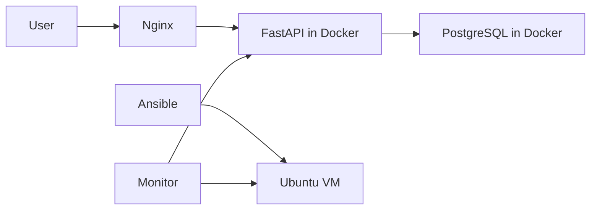

# Server Operations Lab

Deploy and operate a small FastAPI + PostgreSQL service on Ubuntu using
Docker Compose, Nginx, and Ansible — with health checks, backup/restore
tests, and documented troubleshooting exercises.

Built as a hands-on DevOps / System Administration portfolio project.

## Architecture



Request flow:

```
Client → Nginx (port 80) → FastAPI (uvicorn) → PostgreSQL
```

## What this demonstrates

| Skill | Where in repo |
|---|---|
| Linux server operations | Ubuntu VM setup (`docs/`) |
| Docker & Compose | `compose.yaml`, `app/Dockerfile` |
| Nginx reverse proxy | `nginx/` |
| Ansible configuration automation | `ansible/` |
| Monitoring & health checks | `scripts/health_check.sh` |
| Backup & restore validation | `scripts/backup_db.sh`, `scripts/restore_db.sh` |
| Troubleshooting method | `docs/troubleshooting.md` |
| CI with GitHub Actions | `.github/workflows/ci.yml` |
| Git workflow (branches + PRs) | repository history |

## Modules

| # | Module | Status |
|---|---|---|
| 0 | Repo scaffold | ✅ |
| 1 | FastAPI app (local) | ✅ [PR #1](https://github.com/ziaur390/server-operations-lab/pull/1) |
| 2 | PostgreSQL integration | ✅ [PR #2](https://github.com/ziaur390/server-operations-lab/pull/2) |
| 3 | Docker Compose | ✅ [PR #3](https://github.com/ziaur390/server-operations-lab/pull/3) |
| 4 | Nginx reverse proxy | ✅ [PR #4](https://github.com/ziaur390/server-operations-lab/pull/4) |
| 5 | Target server (Ubuntu/WSL2) | ✅ [PR #6](https://github.com/ziaur390/server-operations-lab/pull/6) |
| 6 | Ansible automation | ✅ [PR #7](https://github.com/ziaur390/server-operations-lab/pull/7) |
| 7 | Health checks & monitoring | ✅ [PR #8](https://github.com/ziaur390/server-operations-lab/pull/8) |
| 8 | Backup & restore test | ✅ [PR #9](https://github.com/ziaur390/server-operations-lab/pull/9) |
| 9 | Troubleshooting exercises | ✅ [PR #10](https://github.com/ziaur390/server-operations-lab/pull/10) |
| 10 | GitHub Actions CI | ✅ [PR #11](https://github.com/ziaur390/server-operations-lab/pull/11) |

Every module was built on its own branch and merged through a pull
request — see the [closed PRs](https://github.com/ziaur390/server-operations-lab/pulls?q=is%3Apr+is%3Aclosed)
for the full review trail, and
[docs/troubleshooting.md](docs/troubleshooting.md) for twelve real
failures hit during the build.

## Interview summary

> I automated the deployment of a small FastAPI service to an Ubuntu
> server using Ansible and Docker Compose. I configured Nginx as a
> reverse proxy, built a health-check system with exit-code signaling
> and cron scheduling, and tested PostgreSQL recovery by restoring a
> backup into a fresh database and verifying the data. CI runs the API
> tests against a PostgreSQL service container and builds the image on
> every pull request.

## Repository layout

```text
server-operations-lab/
├── app/                   # FastAPI code
├── compose.yaml           # API and PostgreSQL services
├── nginx/                 # Nginx configuration
├── ansible/               # Inventory and playbook
├── scripts/               # Health check and backup/restore scripts
├── docs/                  # Diagram, setup notes, troubleshooting record
├── .github/workflows/     # CI
├── .gitignore
└── README.md
```

## Documentation

- [Setup guide](docs/setup.md) — how to run everything
- [Troubleshooting record](docs/troubleshooting.md) — controlled failures and fixes
- [Design decisions](docs/decisions.md) — why each component exists

## Security notes

- No credentials in the repository. Local settings live in `.env` (gitignored).
- Backup files with real data are gitignored.
- Sample data only — no personal or confidential records.
