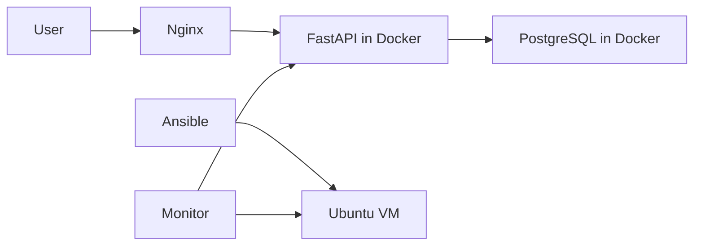

# Server Operations Lab

Deploy and operate a small FastAPI + PostgreSQL service on Ubuntu using
Docker Compose, Nginx, and Ansible — with health checks, backup/restore
tests, and documented troubleshooting exercises.

Built as a hands-on DevOps / System Administration portfolio project.

## Architecture



Request flow:

```
Client → Nginx (port 80) → FastAPI (uvicorn) → PostgreSQL
```

## What this demonstrates

| Skill | Where in repo |
|---|---|
| Linux server operations | Ubuntu VM setup (`docs/`) |
| Docker & Compose | `compose.yaml`, `app/Dockerfile` |
| Nginx reverse proxy | `nginx/` |
| Ansible configuration automation | `ansible/` |
| Monitoring & health checks | `scripts/health_check.sh` |
| Backup & restore validation | `scripts/backup_db.sh`, `scripts/restore_db.sh` |
| Troubleshooting method | `docs/troubleshooting.md` |
| CI with GitHub Actions | `.github/workflows/ci.yml` |
| Git workflow (branches + PRs) | repository history |

## Modules

| # | Module | Status |
|---|---|---|
| 0 | Repo scaffold | ✅ |
| 1 | FastAPI app (local) | ⏳ |
| 2 | PostgreSQL integration | ⏳ |
| 3 | Docker Compose | ⏳ |
| 4 | Nginx reverse proxy | ⏳ |
| 5 | Ubuntu VM | ⏳ |
| 6 | Ansible automation | ⏳ |
| 7 | Health checks & monitoring | ⏳ |
| 8 | Backup & restore test | ⏳ |
| 9 | Troubleshooting exercises | ⏳ |
| 10 | GitHub Actions CI | ⏳ |

## Repository layout

```text
server-operations-lab/
├── app/                   # FastAPI code
├── compose.yaml           # API and PostgreSQL services
├── nginx/                 # Nginx configuration
├── ansible/               # Inventory and playbook
├── scripts/               # Health check and backup/restore scripts
├── docs/                  # Diagram, setup notes, troubleshooting record
├── .github/workflows/     # CI
├── .gitignore
└── README.md
```

## Documentation

- [Setup guide](docs/setup.md) — how to run everything
- [Troubleshooting record](docs/troubleshooting.md) — controlled failures and fixes
- [Design decisions](docs/decisions.md) — why each component exists

## Security notes

- No credentials in the repository. Local settings live in `.env` (gitignored).
- Backup files with real data are gitignored.
- Sample data only — no personal or confidential records.
